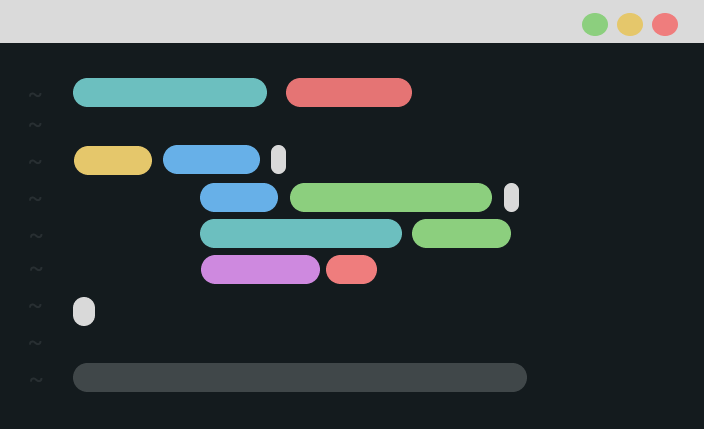

 

<h1 align="center">Everblush</h1> 
<h4 align="center"><i>A Dark, vibrant and beautiful colorscheme for your desktop</i></h4> 

# About 
Everblush is colorscheme like the others in the ricer's community. But with beautiful syntax highlighting and colors.

## Ports 
# Editors
- [Vim](https://github.com/Everblush/everblush.vim)
- [Neovim](https://github.com/Everblush/everblush.nvim)
- [VsCode](https://github.com/Everblush/vscode)
- [Obsidian](https://github.com/Everblush/Obsidian) - (markdown editor)
- [Doom Emacs](https://github.com/Everblush/doomemacs)
- [Emacs](https://github.com/Everblush/emacs)
- [Lite-XL](https://github.com/Everblush/lite-xl)

# Terminal Emulators 
- [Gnome-Terminal](https://github.com/Everblush/terminal-emulators/tree/main/src/gnome-terminal)
- [Tym](https://github.com/Everblush/terminal-emulators/tree/main/src/tym)
- [Kitty](https://github.com/Everblush/terminal-emulators/blob/main/src/kitty.conf)
- [Alacritty](https://github.com/Everblush/terminal-emulators/blob/main/src/alacritty.yml)
- [Xfce4-Terminal](https://github.com/Everblush/terminal-emulators/tree/main/src/xfce4-terminal)
- [Xresource](https://github.com/Everblush/terminal-emulators/blob/main/src/Xresources)

# GTK 
- [GTK](https://github.com/Everblush/gtk)

# Chat Apps
- [Discord](https://github.com/Everblush/Discord)
- [Telegram](https://github.com/Everblush/telegram)

# Miscallaneous 
- [Bat](https://github.com/Everblush/bat)
- [Fzf](https://github.com/Everblush/fzf)
- [Zathura](https://github.com/Everblush/zathura)
- [rofi](https://github.com/Everblush/rofi)

# Wallpaper 
- [Wallpapers](https://github.com/Everblush/wallpapers)

# Contribution
- The contribution details will be soon released as they are WIP.

# Credits ❤️
- [HTMLCOLORCODES](https://htmlcolocodes.com)
- [Hex-colors](https://siduck.github.io/hex-tools)
